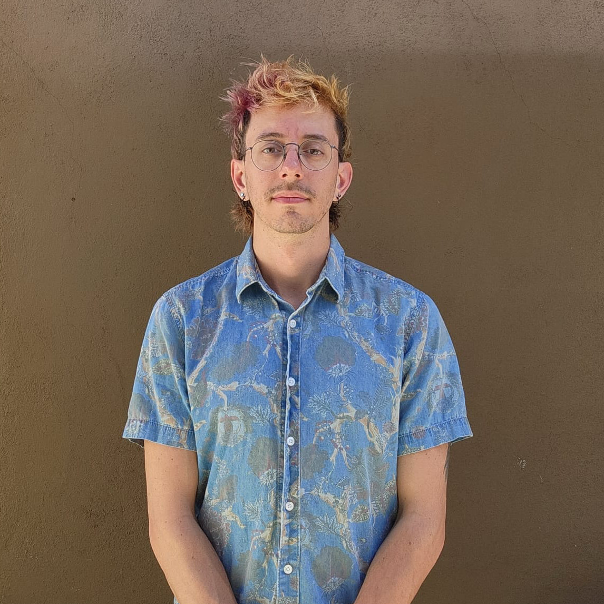

# Ethan Jahn, PhD

<!-- *computational astrophysicist | educator | hpc facilitator | musician | artist* -->

---

This website is a place to host my professional and personal projects, especially as the line between the two is becoming increasingly blurred. 

<!-- " display: block; margin-left: auto; margin-right: auto;"> -->

## Bio

I am currently employed as an [HPC Facilitator](https://hpcdocs.hpc.arizona.edu) at the University of Arizona, where I assist researchers in using the supercomputer system. Prior to this position, I taught as an adjunct prof at a handful of community colleges in Southern California, mostly covering introductory calculus-based physics courses. And prior to that, I researched the formation of dwarf galaxies using computational methods at UC Riverside. [Here](https://ui.adsabs.harvard.edu/search/fq=%7B!type%3Daqp%20v%3D%24fq_database%7D&fq_database=database%3A%20astronomy&q=author%3A(%22%5Ejahn%2C%20ethan%22)&sort=date%20desc%2C%20bibcode%20desc&p_=0) are my papers, and [here](cv.md) is my CV.

I am also an artist, musician, and science communicator. 

Feel free to click through my various projects in the tabs to the left

<!-- I am a scientist by formal academic training. I currently work at the University of Arizona's Research Computing facility as a consultant, where I perform a variety of tasks in support of researchers using our High Performance Computer. -->

<!-- I was previously an adjunct physics instructor at a variety of community colleges in southern california, and a PhD student studying the formation of dwarf galaxies prior to that. See my full CV [here](cv.md). -->

<!-- I am a musician by combination of formal training and informal practice. I write, perform, produce, record, engineer, mix, and master, to differing degrees of refinement. I'm interested in performance art, sound-as-space, and collective improvisation as means of expression.  -->

<!-- I am an artist mostly by way of informal practice and self-taught methods, though I took a variety of design courses in high school. My primary media are digital collage, generative code art, and film photography, though I also engage with other physical (e.g. cyanotyping) and written (e.g. poetry) media. -->

---

<!-- My current goal is to converse between traditional scientific tools and methods, and the associative-metaphorical understanding practiced in humanities and the arts. Exapting the theory of opponent processing from psychological neuroscience: where science draws distinctions, the arts draw associations, creating a richer tapestry of interconnected meaning than either could develop on its own. Interdisciplinarity is mutualism.  -->

<!-- I attempt to engage with this in several ways: an interdisciplinary reading group called *Salon*, digital art projects that both represent this mutualism and practice it, and development of programming at UA that supports artists, scientists, or both, including *Artistic Expression of Original Research*, and workshops on computational methods in research.  -->